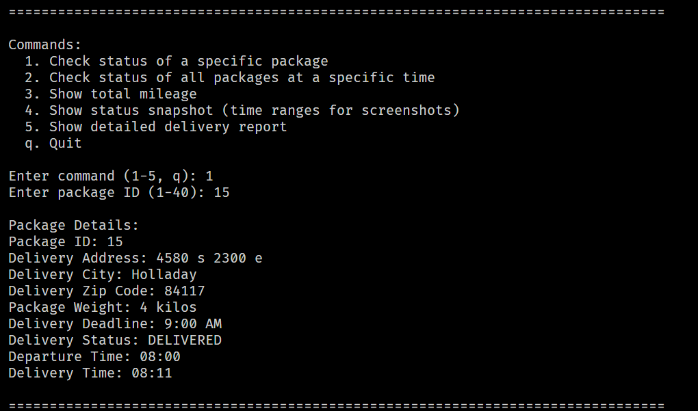
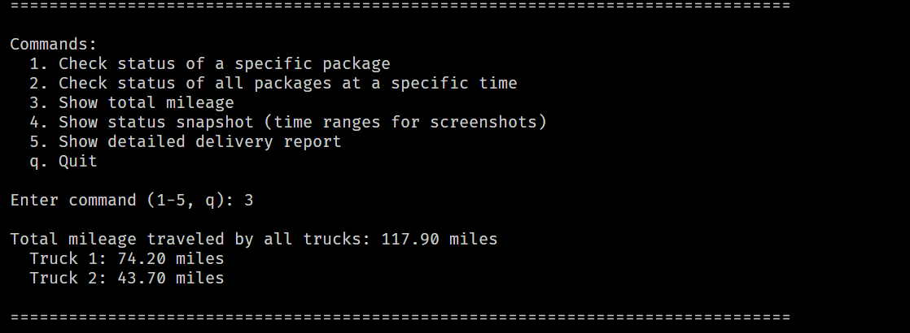
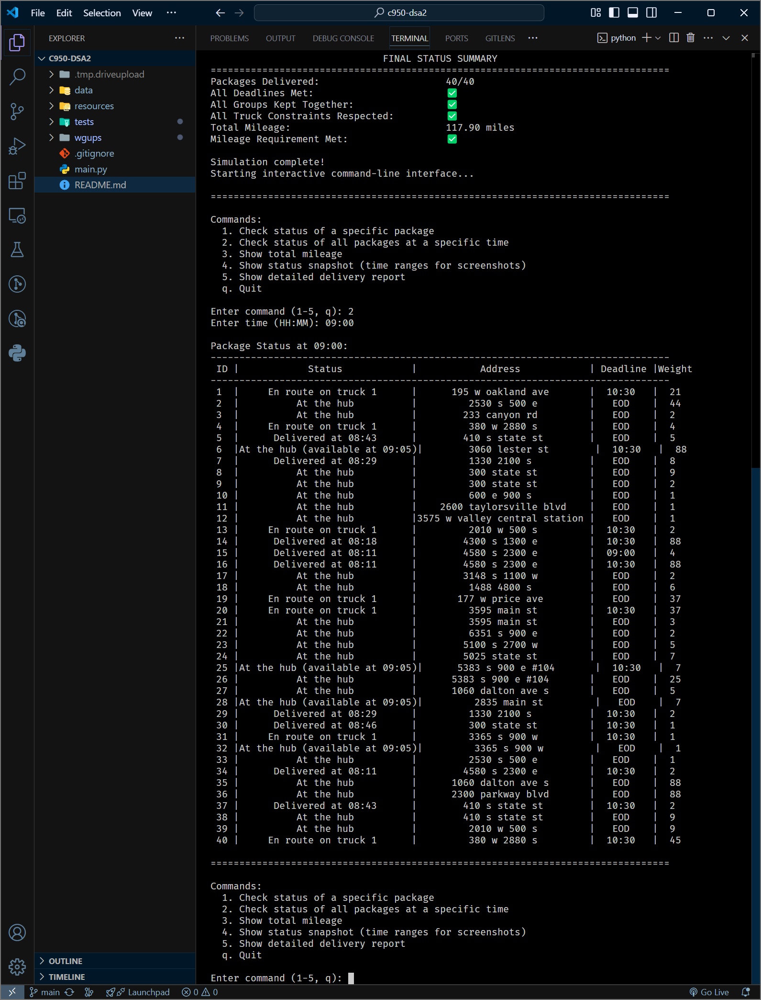
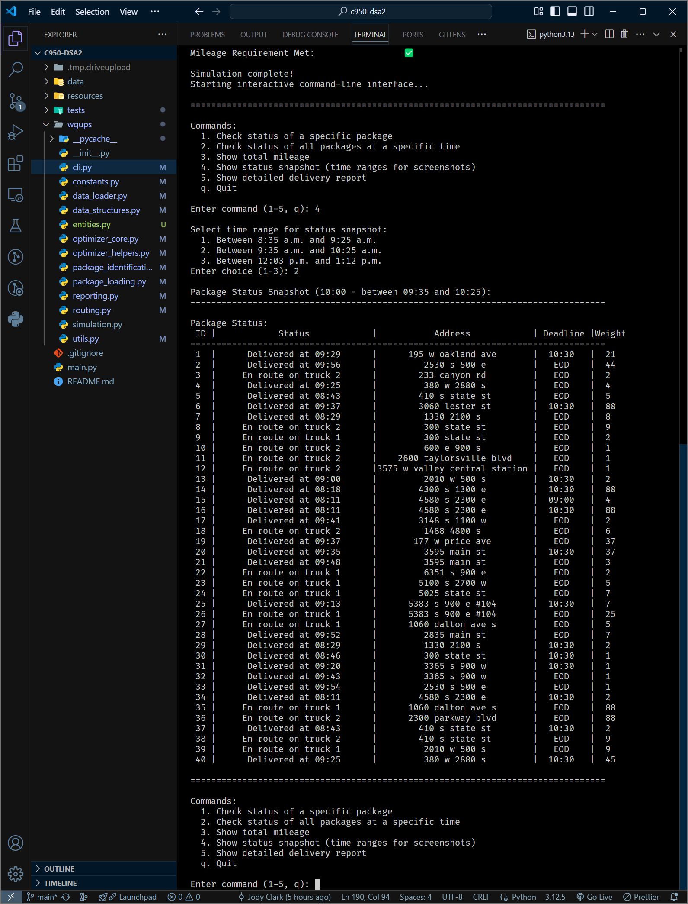
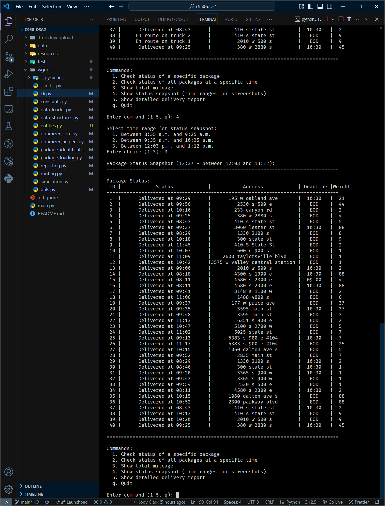
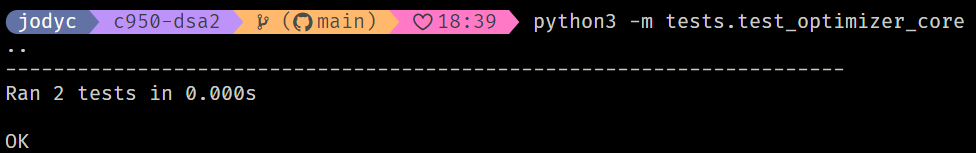

# 📦 WGUPS Package Delivery Routing System


## 🚀 Project Overview

The **WGUPS Package Delivery Routing System** is a sophisticated, command-line application designed to efficiently manage and optimize parcel deliveries for a simulated logistics scenario at Western Governors University. This system employs advanced routing algorithms and detailed constraint handling to ensure timely deliveries, minimal mileage, and seamless operations.

---

## ✨ Key Features

### 📌 Automated Package Handling

- **Intelligent Loading**: Automates loading of packages onto trucks based on deadlines, truck-specific requirements, delays, and delivery groups.
- **Dynamic Constraints**: Handles real-time package updates, such as address corrections and delayed package availability.

### 🚚 Advanced Routing Optimization

- **Nearest Neighbor Algorithm**: Quickly generates efficient routes prioritizing urgent deadlines.
- **2-Opt Route Refinement**: Enhances route efficiency further while ensuring no deadlines are compromised.
- **Permutation-Based Optimization**: Dynamically handles small sets of deadline-critical packages to ensure optimal delivery times.

### 🧩 Custom Data Structures

- **Hash Table Implementation**: Ensures O(1) average-time complexity for package lookup, insertion, and deletion, facilitating rapid data access and updates.

### 📊 Interactive CLI Interface

- Provides real-time package tracking, detailed status updates, and mileage reports.
- Offers easy-to-navigate menus for package queries, system status snapshots, and comprehensive delivery reports.

### 🛠️ Robust Testing Suite

- **Unit Tests**: Coverage includes critical components like package models, truck logic, CSV loaders, and utility functions.
- Ensures reliability and stability through rigorous automated testing.

### 📑 Detailed Reporting and Logging

- **Activity Logs**: Rich, timestamped logs capture detailed truck activities, including package loading, route decisions, and deliveries.
- **Summary Reports**: Comprehensive constraint satisfaction and mileage reports confirm operational excellence and project compliance.

---

## 🖥️ Project Structure

```
main.py                      # Program entry point
data/
├── distances.csv            # Address and mileage data
└── packages.csv             # Package data
wgups/
├── cli.py                   # Interactive command-line interface
├── constants.py             # Centralized configuration and constants
├── data_loader.py           # CSV parsing and data initialization
├── data_structures.py       # Custom hash table for efficient storage
├── models.py                # Core data models (Package, Truck)
├── optimizer_core.py        # Routing optimization algorithms
├── optimizer_helpers.py     # Utility functions for route optimization
├── package_identification.py# Intelligent package classification
├── package_loading.py       # Automated truck loading logic
├── reporting.py             # Detailed reporting utilities
├── routing.py               # Route execution logic
├── simulation.py            # Full delivery simulation logic
├── utils.py                 # General helper functions
tests/
├── test_loaders.py          # Data loader tests
├── test_package.py          # Package model tests
├── test_truck.py            # Truck model tests
├── test_optimizer_core.py   # Optimization algorithm tests
└── test_utils.py            # Utility function tests

```

---

## 💡 Highlights and Innovations

- **End-to-End Automation**: Packages are intelligently assigned to trucks and routes based on constraints like deadlines, delays, and delivery group. No need for manual input.
- **Efficient Route Optimization**: Combines nearest neighbor, 2-opt, and permutation-based strategies to optimize delivery timing and mileage within project limits.
- **Modular, Extensible Design**: Separates concerns across loaders, optimizers, and simulation logic, making it easy to maintain and expand.
- **Detailed Reporting & Logging**: Built-in reporting tools validate performance and constraints at a glance, supporting transparency and easy debugging.

---

## ⚡ How to Run

**Prerequisites**:

- Python 3.x (no external dependencies required)

**Steps**:

1. Clone the repository:

   ```bash
   git clone https://github.com/jclark-14/wgups-routing-optimizer
   cd c950-dsa2
   ```

2. Execute the program:

   ```bash
   python3 main.py
   ```

3. Use the intuitive CLI:

   ```
   Commands:
   [1] Check specific package status
   [2] Check all package statuses at a given time
   [3] View total mileage
   [4] Show detailed delivery report
   [q] Quit
   ```

---

## 🧪 Running Tests

Execute comprehensive unit tests for project reliability:

```bash
python3 -m tests.test_package
python3 -m tests.test_loaders
python3 -m tests.test_utils
python3 -m tests.test_truck
python3 -m tests.optimizer_core
```

---

## 🚩 Future Improvements

- Integrate additional advanced algorithms (Simulated Annealing, Genetic Algorithms).
- Web-based visualization for real-time package tracking.
- Expanded data analysis tools for operational insights.

---

## 📷 Program Screenshots

### 🧭 CLI Menu and Individual Package Check



### 📋 Final Summary Report (All Constraints Met)


### 🚛 Total Mileage Display



### 🕐 Package Status at 9:00 AM



### 🕙 Package Status at 10:00 AM



### 🕧 Final Status Snapshot



### ✅ Unit Test Output



---
