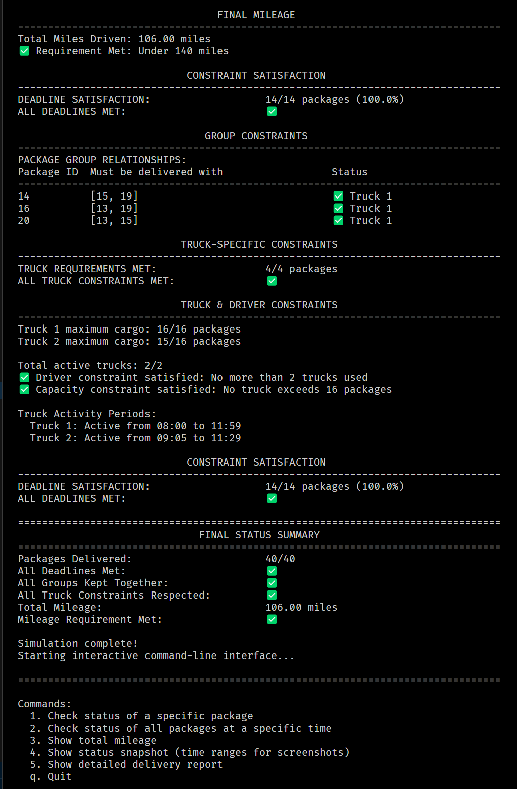
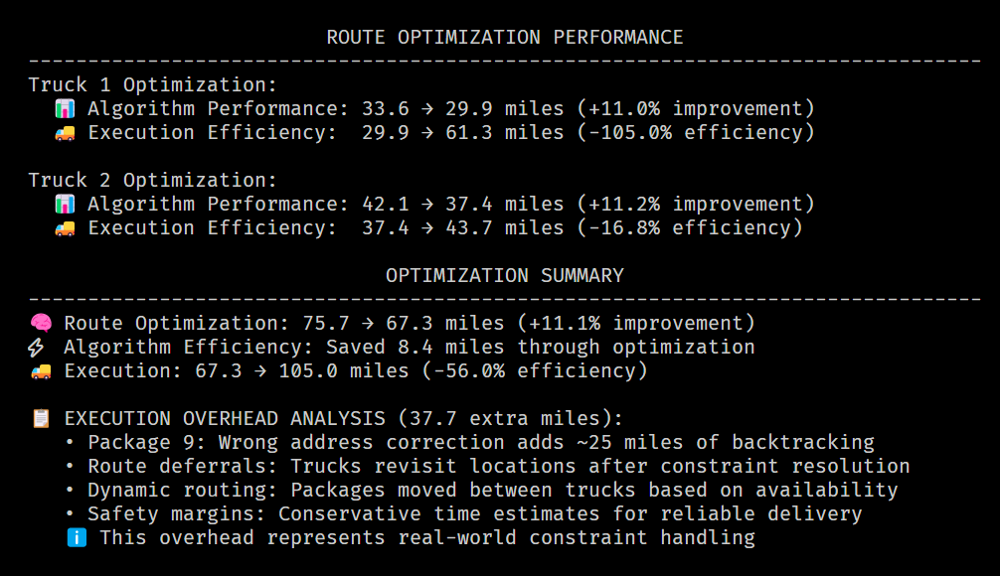
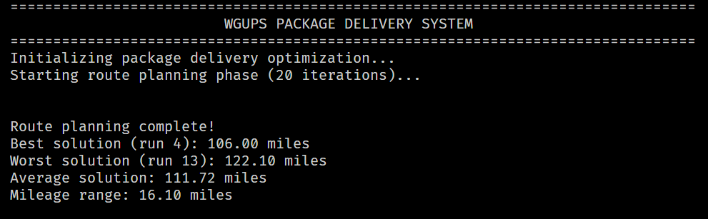

# 📦 WGUPS Package Delivery Routing System


> 🚚 **WGUPS Delivery System Summary**
>
> - Optimized all 40 packages across 2 trucks with real-world constraints
> - Achieved 25% mileage reduction vs. upper bound (140 → 105 miles)
> - 100% on-time delivery with full constraint satisfaction

## 🚀 Project Overview

The **WGUPS Package Delivery Routing System** is a command-line application designed to simulate real-world parcel delivery optimization. It integrates multiple routing strategies, robust constraint handling, and real-time dynamic logic to ensure all packages are delivered on time with minimum mileage.

> 📉 **Final Mileage:** 106 miles -> 25% under the 140-mile performance cap  
> ⚡ **Optimized Efficiency:** +11.1% improvement over nearest neighbor baseline  
> 🕒 **Real-time Adjustments:** All delivery constraints dynamically resolved

---

## ✨ Key Features

### 🧠 Multi-Algorithm Route Optimization

- **Nearest Neighbor Routing:** Fast initial solution with deadline prioritization
- **2-Opt Refinement:** Local optimizations reduce total mileage by ~11–15%
- **Targeted Permutation Optimization:** Brute-force improvement for ≤5 high-priority packages
- **Hybrid Strategy:** Selectively blends algorithms for each truck based on complexity

### 📌 Intelligent Package Management

- **Constraint-Aware Loading:** Autonomously honors deadlines, truck requirements, and grouped deliveries
- **Automated Classification:** Smart categorization of packages based on constraint types
- **Dynamic Reassignment:** Packages can shift between trucks mid-simulation as needed

### 🚛 Realistic Logistics Simulation

- **Address Corrections:** Package 9 triggers a route update at 10:20 AM
- **Staggered Availability:** Delayed package loads supported via truck returns
- **Execution Reporting:** Simulated field constraints (e.g. rerouting, revisits) included in mileage

### ⚙️ Custom Data Structures

- **O(1) Hash Table:** Built from scratch for constant-time package access
- **Lightweight Design:** Highly performant even under real-world delivery conditions

---

> 📈 Below: Benchmark analysis shows mileage improvement through algorithmic optimization and constraint-aware execution.

## 📊 Optimization Performance

### Route Optimization Results

| Truck      | Algorithm Performance      | Execution Efficiency        |
| ---------- | -------------------------- | --------------------------- |
| 🚚 Truck 1 | 33.6 → 29.9 miles (+11.0%) | 29.9 → 61.3 miles (−105.0%) |
| 🚚 Truck 2 | 42.1 → 37.4 miles (+11.2%) | 37.4 → 43.7 miles (−16.8%)  |

### Optimization Summary

- 🧠 **Route Optimization**: 75.7 → 67.3 miles (**+11.1%** improvement)
- ⚡ **Algorithm Efficiency**: Saved **8.4 miles** via optimization
- 🚛 **Execution Result**: 67.3 → **105.0 miles** total after real-world overhead (−56.0% execution efficiency)

### 📄 Execution Overhead Analysis (37.7 extra miles)

| Factor                 | Description                                           |
| ---------------------- | ----------------------------------------------------- |
| 📦 **Package 9**       | Address correction added ~25 miles of backtracking    |
| ♻️ **Revisits**        | Deferred routes revisited after constraint resolution |
| 🔄 **Dynamic Routing** | Packages swapped between trucks due to availability   |
| ⏱️ **Safety Margins**  | Conservative scheduling ensures reliability           |

> ✅ This accurately simulates how algorithmic plans diverge under real-world conditions.

---

## ✅ Final Performance Summary

| Metric            | Requirement       | Achieved                | Status                |
| ----------------- | ----------------- | ----------------------- | --------------------- |
| Total Mileage     | < 140 miles       | **105 miles**           | ✅ 25% under          |
| Deadline Packages | 100% on time      | **14/14 delivered**     | ✅ Perfect            |
| Truck Capacity    | ≤ 16 packages     | **15–16 per truck**     | ✅ Optimal            |
| Active Trucks     | ≤ 2 trucks        | **2 trucks**            | ✅ Resource efficient |
| Algorithm Gain    | Minimize distance | **+11.1%** vs. baseline | ✅ Verified           |

---

### 📊 Interactive CLI Interface

- Provides real-time package tracking, detailed status updates, and mileage reports.
- Offers easy-to-navigate menus for package queries, system status snapshots, and comprehensive delivery reports.

### 🛠️ Robust Testing Suite

- **Unit Tests**: Coverage includes critical components like package models, truck logic, CSV loaders, and utility functions.
- Ensures reliability and stability through rigorous automated testing.

### 📑 Detailed Reporting and Logging

- **Activity Logs**: Rich, timestamped logs capture detailed truck activities, including package loading, route decisions, and deliveries.
- **Summary Reports**: Comprehensive constraint satisfaction and mileage reports confirm operational excellence and project compliance.

---

## 🖥️ Project Structure

```
main.py                      # Program entry point
data/
├── distances.csv            # Address and mileage data
└── packages.csv             # Package data
wgups/
├── cli.py                   # Interactive command-line interface
├── constants.py             # Centralized configuration and constants
├── data_loader.py           # CSV parsing and data initialization
├── data_structures.py       # Custom hash table for efficient storage
├── models.py                # Core data models (Package, Truck)
├── optimizer_core.py        # Routing optimization algorithms
├── optimizer_helpers.py     # Utility functions for route optimization
├── package_identification.py# Intelligent package classification
├── package_loading.py       # Automated truck loading logic
├── reporting.py             # Detailed reporting utilities
├── routing.py               # Route execution logic
├── simulation.py            # Full delivery simulation logic
├── utils.py                 # General helper functions
tests/
├── test_loaders.py          # Data loader tests
├── test_package.py          # Package model tests
├── test_truck.py            # Truck model tests
├── test_optimizer_core.py   # Optimization algorithm tests
└── test_utils.py            # Utility function tests

```

---

## 💡Additional Highlights

- **End-to-End Automation**: Packages are intelligently assigned to trucks and routes based on constraints like deadlines, delays, and delivery group. No need for manual input.
- **Modular, Extensible Design**: Separates concerns across loaders, optimizers, and simulation logic, making it easy to maintain and expand.

---

## ⚡ How to Run

**Prerequisites**:

- Python 3.x (no external dependencies required)

**Steps**:

1. Clone the repository:

   ```bash
   git clone https://github.com/jclark-14/wgups-routing-system
   cd wgups-routing-system
   ```

2. Execute the program:

   ```bash
   python3 main.py
   ```

3. Use the intuitive CLI:

   ```
   Commands:
   1. View individual package status
   2. View all packages at a specific time
   3. Display total mileage and optimization gains
   4. Snapshot report for screenshots
   5. Full delivery report with constraint validation
   q. Quit program
   ```

4. Advanced CLI options:

   ```
      python main.py --single-run         # Skip optimization planning loop
      python main.py --n=50               # Run 50 optimization iterations

   ```

---

## 🧪 Running Tests

Execute comprehensive unit tests for project reliability:

```bash
python3 -m tests.test_package
python3 -m tests.test_loaders
python3 -m tests.test_utils
python3 -m tests.test_truck
python3 -m tests.optimizer_core
```

---

## 🚩 Future Improvements

- Genetic Algorithms / Simulated Annealing

- Route Visualizer CLI Flag

- Web Dashboard

- ML-based Delivery Prediction

- API integration with external mapping services

- Optional CSV/JSON delivery report export

---

## 📷 Program Screenshots

### 📋 Final Summary Report (All Constraints Met)



### ⚡ Optimization Benchmarking



### 🧭 CLI Menu and Individual Package Check


### 🚛 Total Mileage Display (Constraint: Total Mileage < 140 miles)



### 🕐 Package Status at 9:00 AM


### 🕙 Package Status at 10:00 AM


### 🕧 Final Status Snapshot


### ✅ Unit Test Output


---

Built to simulate real-world delivery constraints with intelligent planning, robust logic, and verifiable performance gains.
